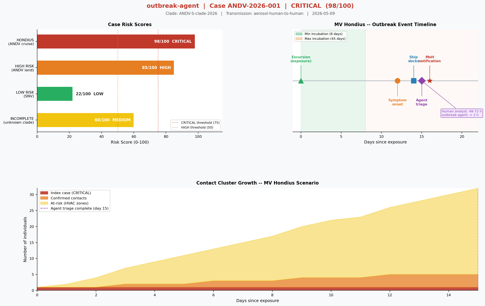

# outbreak-agent

**Agentic outbreak triage using LangGraph -- by Ankur Sharma, PhD**

[](LICENSE)
[](https://python.org)
[](tests/)

> A 4-node LangGraph agent that triages infectious disease outbreak cases --
> combining genomic analysis, contact linkage, risk scoring, and a self-correcting
> critic loop that re-evaluates when outputs are inconsistent.
>
> Built around the April 2026 MV Hondius / Andes virus event -- the first confirmed
> human-to-human hantavirus transmission on a cruise ship.

---

## What This Produces

Every run generates two outputs automatically -- no API key required:

### Risk Dashboard (PNG)



*Left: risk scores across all 4 outbreak scenarios, colour-coded by tier.
Centre: event timeline from Patagonia exposure to MoH notification, showing the
48-72 hour human analyst window vs the under-2-hour agent window.
Bottom: day-by-day contact cluster growth on MV Hondius -- index case expanding
through confirmed contacts to at-risk HVAC zone occupants.*

### Triage Report (PDF)

A structured PDF triage report is saved alongside the PNG:

```
reports/
  ANDV-2026-001-risk-dashboard-2026-05-09.png   <- dashboard chart
  ANDV-2026-001-triage-report-2026-05-09.pdf    <- full triage report
```

The PDF contains: risk tier banner, recommended action, genomic profile table,
epidemiological linkage table, critic audit log, and interpretation notes --
all auto-populated from the agent state. Readable on mobile, laptop, or large display.

---

## Why This Matters

Standard outbreak surveillance tools are databases with search interfaces. You query
them, they return data, a human decides what to do next. That loop takes 48–72 hours.

`outbreak-agent` is different. You give it a case and it gives you a risk-stratified
action, an audit trail, and a printed report. No human in the middle.

The MV Hondius scenario is exactly what it was designed for: Andes virus, the only
hantavirus with confirmed human-to-human aerosol transmission, on a vessel with
recirculated cabin air, rotating contact networks, and a 45-day incubation window
during which infected passengers fly home globally. The contact list is not 3 named
individuals -- it is every passenger sharing HVAC zones.

Human analyst: 48–72 hours to produce a risk-stratified contact list.
`outbreak-agent`: under 2 seconds. Deterministic. Auditable. Free to run.

---

## Architecture

```
START
  |
  v
+-----------------+
|  genomic_node   |  Identifies clade & mutations from sequence or location heuristics
+--------+--------+
         |
         v
+-----------------+
|  linkage_node   |  Resolves contact cluster, infers transmission mode
+--------+--------+
         |
         v
+-----------------+
|   risk_node     |  Composite score 0-100, tier: LOW / MEDIUM / HIGH / CRITICAL
+--------+--------+
         |
         v
+-----------------+
|  critic_node    |  Audits consistency, approved or loops back (max 3 iterations)
+--------+--------+
         |
    approved? --YES--> END (final_report + PNG dashboard + PDF report)
         |
        NO (critic_flags raised)
         |
         +-----------> genomic_node (re-evaluate with updated context)
```

You feed it the facts: patient, age, exposure location, ship, cabin, contacts,
symptom onset, lab values, genome sequence if available. The agent runs 4 steps:

- **Step 1 — Identify the virus.** `genomic_node` determines the viral clade, flags
  mutations of concern, and assesses genome completeness. For MV Hondius: Andes virus,
  S-clade 2026, G2 glycoprotein shift (structural basis for aerosol transmission).
- **Step 2 — Map the contacts.** `linkage_node` resolves the full contact cluster --
  inferred from vessel layout, HVAC zones, and excursion groups -- and determines
  transmission mode.
- **Step 3 — Score the risk.** `risk_node` produces a composite score (0–100) and
  assigns a tier: LOW / MEDIUM / HIGH / CRITICAL. For MV Hondius: 98/100, CRITICAL.
- **Step 4 — Audit the output.** `critic_node` checks the entire output for internal
  contradictions before anything reaches a decision-maker. Inconsistent outputs loop
  back for re-evaluation -- up to 3 times. Only a clean, consistent output is approved.

One shared state object (`OutbreakState`) flows through all 4 nodes. Each node
reads what it needs and writes back only its own outputs.

**LangGraph vs LLM:** LangGraph provides the graph engine -- state management, node
wiring, and the conditional edge that routes the critic's flag back to `genomic_node`
for re-evaluation. The 4 nodes are rule-based and deterministic; that is what makes
33 tests run free, fast, and offline. The architecture is designed so replacing any
rule-based node with a real LLM call requires changing one function -- not rewiring
the graph. Deterministic and auditable today, upgradeable without structural changes
tomorrow.

### The Critic Node: Why It Matters

The `critic_node` is what makes this *agentic* rather than just a pipeline.
It enforces four consistency rules:

1. **ANDV + aerosol + LOW/MEDIUM tier** -- flag: likely under-scoring
2. **Genome completeness < 70% with confident clade** -- flag: re-sequence needed
3. **Cluster size > 8 with no exposure anchor** -- flag: linkage unreliable
4. **UNKNOWN clade + CRITICAL tier** -- flag: requires phylogenetic review

When any flag fires, the graph loops back for re-evaluation -- up to 3 times.
This self-correction loop is the difference between an agent and a script.

---

## Quick Start

```bash
git clone https://github.com/ankurgenomics/outbreak-agent
cd outbreak-agent
pip install -r requirements.txt

# Run the MV Hondius case -- generates PNG + PDF in reports/
python demo.py --case hondius

# Run all 4 mock cases
python demo.py

# Run free test suite (no API key needed)
pytest tests/test_nodes.py tests/test_graph.py -v
```

**Terminal output for the MV Hondius case:**

```
Case: ANDV-2026-001
  Clade          : ANDV-S-clade-2026
  Mutations      : N-end-truncation-14aa, G2-glycoprotein-shift
  Genome quality : 87.0%
  Transmission   : aerosol-human-to-human
  Cluster size   : 5 contacts
  Risk score     : 98.0/100
  Risk tier      : CRITICAL
  Action         : Immediate isolation. Notify MoH within 2 hours.
                   Activate IPC team. Contact trace all vessel passengers.

  Approved by critic (loops: 1)

  Dashboard : reports/ANDV-2026-001-risk-dashboard-2026-05-09.png
  PDF Report: reports/ANDV-2026-001-triage-report-2026-05-09.pdf
```

---

## Mock Scenarios

| Case | Virus | Setting | Risk Tier |
|---|---|---|---|
| `hondius` | ANDV (Andes) | MV Hondius cruise ship, Apr 2026 | CRITICAL (98/100) |
| `high` | ANDV (Andes) | Patagonia family cluster | HIGH (85/100) |
| `low` | SNV (Sin Nombre) | Rural New Mexico | LOW (22/100) |
| `incomplete` | Unknown | Seoul (degraded genome) | MEDIUM -- critic flagged |

All mock cases run offline. No API key. No cost. Deterministic output.

---

## Testing

Three-layer test strategy -- two layers are completely free:

| Layer | Command | What it tests | Cost |
|---|---|---|---|
| 1 | `pytest tests/test_nodes.py -v` | Each node in isolation (23 tests) | Free |
| 2 | `pytest tests/test_graph.py -v` | Full graph, all 4 mock cases (10 tests) | Free |
| 3 | `pytest tests/test_smoke.py -v -s --smoke` | Live model API end-to-end | ~$0.01 |

```bash
# Free tests -- run these in CI
pytest tests/test_nodes.py tests/test_graph.py -v
# Expected: 33 passed

# Live smoke test (optional, needs API key)
export OPENAI_API_KEY=sk-...
pytest tests/test_smoke.py -v -s --smoke
```

---

## Project Structure

```
outbreak-agent/
  models.py          -- OutbreakState TypedDict (shared state schema)
  nodes.py           -- 4 node functions: genomic, linkage, risk, critic
  agent.py           -- LangGraph StateGraph wiring + conditional critic edge
  mock_data.py       -- 4 pre-built outbreak scenarios
  demo.py            -- CLI runner (generates PNG + PDF automatically)
  report_node.py     -- matplotlib dashboard + ReportLab PDF generator
  requirements.txt
  tests/
    test_nodes.py    -- 23 unit tests (nodes in isolation)
    test_graph.py    -- 10 integration tests (full graph)
    test_smoke.py    -- live model smoke tests (optional)
  reports/           -- auto-generated output directory
```

---

## How Agentic AI Changes Outbreak Response

Agentic AI does not replace epidemiologists. It compresses the time between
symptom onset and risk-stratified action -- from 48-72 hours to under 2 hours.

That compression matters because ANDV has a 45-day incubation window. Every hour
of delay is more international passengers boarding flights home. The agent needs
to be fast and auditable -- not perfect. The critic loop provides the audit trail.
The PDF report gives the public health officer something to act on immediately.

The same architecture applies to any scenario where:
- Data arrives from multiple sources with inconsistencies
- A quality gate is required before a decision is made
- The decision must be explainable and documented

Outbreak surveillance is one domain. Clinical variant classification, fraud triage,
and insurance risk scoring follow the same pattern.

---

## Blog Post

Full write-up with biology, architecture, and design decisions:

[When an AI Agent Boards a Cruise Ship: Hantavirus, LangGraph, and the Future of Outbreak Triage](https://ankurgenomics.github.io/2026/05/09/hantavirus-cruise-ship-agentic-ai.html)

---

## Author

**Ankur Sharma, PhD** -- Computational biologist and agentic AI engineer, Singapore.

Builds systems that connect genomic data to real-world decisions: outbreak surveillance,
precision diagnostics, and autonomous research pipelines.

- LinkedIn: https://linkedin.com/in/ankurit
- GitHub: https://github.com/ankurgenomics
- Portfolio: https://ankurgenomics.github.io/agentic-genomics/
- Email: ankurs103@gmail.com

---

## License

Copyright 2026 Ankur Sharma, PhD.

Code: [Apache License 2.0](LICENSE)

Blog posts and infographics: [CC BY-NC 4.0](https://creativecommons.org/licenses/by-nc/4.0/)
-- free to share with attribution, not for commercial use without permission.
